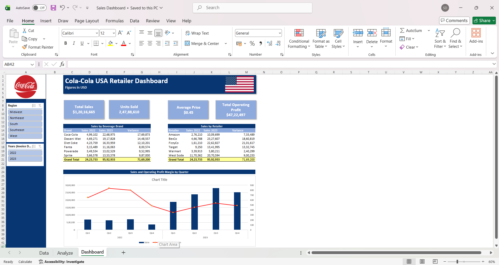

# Sales-Performance-Dashboard-Excel

## Project Overview

This project is an interactive Sales Performance Dashboard built in Microsoft Excel to analyze sales trends and business performance using raw sales data.

## Objectives

- Analyze sales performance across different regions and products.
- Track key business KPIs.
- Present insights through an interactive dashboard.

## Tools Used

- Microsoft Excel
- Pivot Tables
- Pivot Charts
- Slicers
- Conditional Formatting
- Excel Formulas

## Workbook Structure

| Sheet | Purpose |
|-------|---------|
| Data | Raw sales dataset |
| Analyze | Pivot tables and calculations |
| Dashboard | Interactive dashboard and KPIs |

## Key Insights

- Overall sales performance
- Regional sales comparison
- Product-wise analysis
- KPI tracking
- Interactive filtering using slicers

## Skills Demonstrated

- Data Cleaning
- Data Analysis
- Dashboard Design
- Business Intelligence
- KPI Reporting
- Data Visualization

## Dashboard Preview



## Repository Structure

```text
Sales-Performance-Dashboard-Excel/
├── Sales Dashboard.xlsx
├── README.md
└── images/
    ├── dashboard.png
    ├── data-sheet.png
    └── analysis-sheet.png
```
